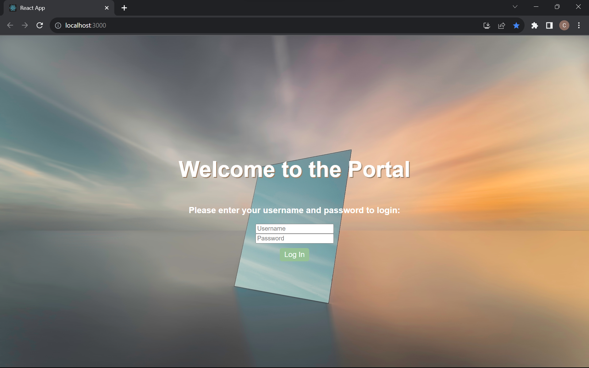
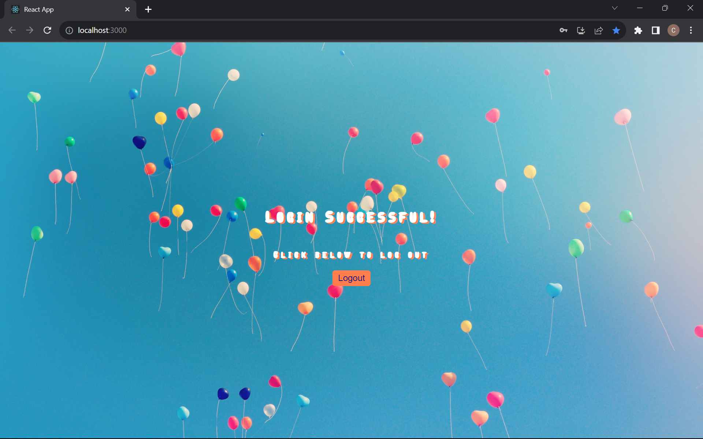
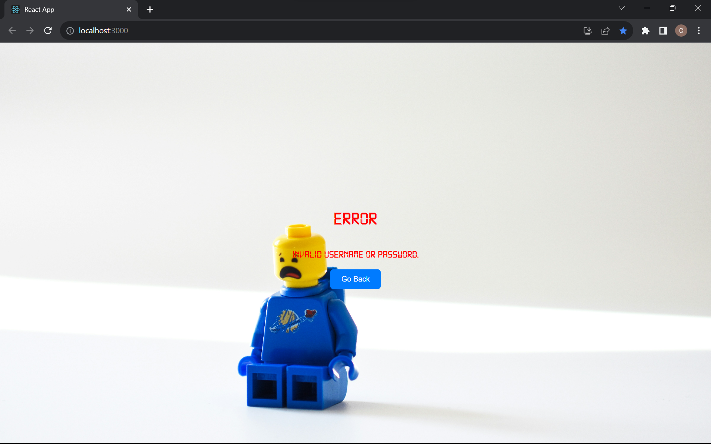

## Description
This React web application uses the `useState` hook to manage user login and logout. The state is updated based on the entered username and password, leading to different screens: welcome, successful login, and failed login error.

### Screenshots & Video Demo

**To view the video demo, go to the `screenshots_recording` folder and download `Portal Screen Recording.mp4`.**

## Installation
To run this project locally, follow these steps:

1. Clone the repository: `git clone https://github.com/charlotteswebdev/LogInLogOut.git`
2. Navigate to the project folder: `cd LogInLogOut`
3. Install dependencies: `npm install`
4. Start the development server: `npm start`

## Contact
Feel free to reach out with any questions or suggestions:
- Charlotte McKnight
- Email: charlottevmcknight@gmail.com
- LinkedIn: https://www.linkedin.com/in/charlottevmcknight/
